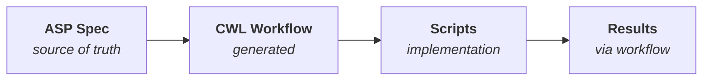

# ASP - Agentic Science Protocol

[](https://github.com/EiffL/ASP/actions/workflows/ci.yml)
[](https://www.python.org/downloads/)
[](https://opensource.org/licenses/Apache-2.0)
[](https://github.com/astral-sh/ruff)

A declarative specification format for scientific analyses that can be executed by AI agents.

## What is ASP?

ASP separates **what** you want to learn from **how** to compute it. You describe:

- **Problem statement** - The research question
- **Inputs** - Data, previous analyses, literature
- **Outputs** - Metrics, figures, tables, models
- **Decisions** - The choices that define your analysis

The ASP specification is the **source of truth**. CWL workflows are generated from it, and results are always produced through the workflow for full reproducibility.



## Key Concepts

**Universe**: A complete set of decisions—one option selected for each decision point. Running a universe produces results that answer your problem statement.

**Multiverse**: The space of all valid decision combinations. Its purpose is transparency and traceability, not exhaustive search. Document the path taken, the paths not taken, and optionally check robustness.

**Evidence-based decisions**: Link decisions to supporting evidence from previous analyses or literature.

**Composability**: Use outputs from one analysis as inputs to another.

## Installation

```bash
git clone https://github.com/EiffL/ASP.git
cd ASP
python -m venv .venv
source .venv/bin/activate
pip install -e .
```

For development (includes pytest, ruff, mypy):
```bash
pip install -e ".[dev]"
```

## Getting Started

### With Claude Code (Recommended)

Create a new analysis project:

```bash
asp init my-analysis
cd my-analysis
claude
```

This creates the project structure and configures Claude Code to auto-install the ASP plugin, which provides skills and tools for designing and executing your analysis.

### Manual Workflow

```bash
asp init my-analysis
cd my-analysis
```

Then follow the workflow:

1. **Design** - Edit `asp.yaml` to define inputs, outputs, and decisions
2. **Generate** - Run `asp workflow generate` to create CWL skeleton
3. **Implement** - Write implementation scripts
4. **Run** - Execute via `asp workflow run` (always use the workflow!)

## Workflow

**ASP is the source of truth. Always follow this order:**

```bash
# 1. Design - create/edit the specification
asp validate asp.yaml
asp universe generate -n baseline

# 2. Generate - create CWL workflow from ASP
asp workflow generate

# 3. Implement - write scripts that the CWL workflow calls
#    Edit workflows/main.cwl and create implementation scripts

# 4. Run - ALWAYS execute through the workflow
asp workflow run universes/baseline.yaml --cwl workflows/main.cwl -o results/
```

## Quick Example

```yaml
$schema: "https://asp-spec.org/v1/schema.json"
version: "1.0"

analysis:
  name: "Iris Classification Study"

  problem: |
    Build a robust classifier for the Iris dataset that accurately
    predicts species from flower measurements.

  inputs:
    - id: iris_data
      type: data
      source: "sklearn.datasets.load_iris"

  outputs:
    - id: accuracy
      type: metric
      dtype: float
      range: [0, 1]
      primary: true

    - id: confusion_matrix
      type: figure
      formats: [png]

decisions:
  scaling:
    label: "Feature Scaling"
    type: method
    importance: 2
    default: standard
    options:
      none:
        label: "No Scaling"
      standard:
        label: "StandardScaler"
      minmax:
        label: "MinMaxScaler"
        incompatible_with: ["model.svm"]

  model:
    label: "Classification Model"
    type: method
    importance: 1
    default: random_forest
    options:
      svm:
        label: "Support Vector Machine"
      random_forest:
        label: "Random Forest"
      logistic:
        label: "Logistic Regression"
```

See [examples/iris/](examples/iris/) for a complete working example.

## CLI Commands

```bash
# Project setup
asp init my-analysis                   # Create new analysis project (with Claude Code plugin)
asp init my-analysis --no-git          # Create without git initialization
asp init my-analysis --local           # Copy skills locally (for development)

# Validation
asp validate asp.yaml                  # Validate analysis specification
asp validate universes/baseline.yaml   # Validate universe against spec

# Exploration
asp info                               # Show analysis summary
asp info --decisions                   # Show decision details
asp viz                                # Visualize decision space (ASCII)
asp viz --format mermaid               # Visualize as Mermaid diagram

# Universe management
asp universe generate --name baseline  # Generate universe from defaults
asp universe check universes/foo.yaml  # Check universe constraints

# Workflow commands
asp workflow generate                  # Generate CWL skeleton from ASP
asp workflow validate --cwl main.cwl   # Validate CWL against ASP
asp workflow show --cwl main.cwl       # Show parameter mapping
asp workflow run universes/x.yaml --cwl main.cwl -o results/  # Run workflow
asp params universes/baseline.yaml     # Generate CWL parameters from universe

# Schema utilities
asp schema export                      # Export JSON schemas to schemas/
asp schema show analysis               # Print analysis schema to stdout
```

## Project Structure

An ASP project created with `asp init` has this structure:

```
my-analysis/
├── asp.yaml              # Analysis specification (SOURCE OF TRUTH)
├── README.md             # Project documentation
├── .gitignore            # Git ignore rules
├── universes/            # Universe definitions (decision selections)
│   └── baseline.yaml
├── workflows/            # CWL workflow files
├── steps/                # Reusable workflow steps
├── results/              # Execution outputs (gitignored)
└── .claude/              # Claude Code configuration
    └── settings.json     # Auto-installs ASP plugin
```

### Plugin Modes

By default, `asp init` configures Claude Code to fetch the ASP plugin from GitHub (marketplace mode). Use `--local` to copy skills directly into the project:

```bash
asp init my-analysis --local
```

This creates:
```
.claude/
├── settings.json         # Hooks configured directly
├── scripts/              # Hook scripts (activate-venv, validate-on-save, etc.)
└── skills/asp/           # Skill files (SKILL.md, workflow-guide.md)
```

**When to use `--local`:**
- Developing or customizing ASP skills
- Offline environments
- Self-contained projects that don't depend on external repos

## Design Principles

1. **Declarative** - Spec says WHAT, not HOW
2. **ASP is source of truth** - CWL is derived from ASP
3. **Workflow-enforced** - Results only through CWL execution
4. **Transparent** - All decisions and alternatives documented
5. **Composable** - Analyses build on each other
6. **Evidence-linked** - Decisions cite supporting evidence
7. **Reproducible** - Precise provenance and execution records

## Documentation

See [DESIGN.md](DESIGN.md) for the complete specification.

## License

Apache 2.0
