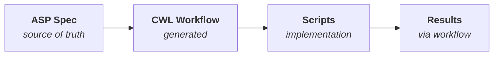

# ASP - Agentic Science Protocol

[](https://github.com/EiffL/ASP/actions/workflows/ci.yml)
[](https://www.python.org/downloads/)
[](https://opensource.org/licenses/Apache-2.0)
[](https://github.com/astral-sh/ruff)

A declarative specification format for scientific analyses that can be executed by AI agents.

## What is ASP?

ASP separates **what** you want to learn from **how** to compute it. You describe:

- **Problem statement** - The research question
- **Inputs** - Data, previous analyses, literature
- **Outputs** - Metrics, figures, tables, models
- **Decisions** - The choices that define your analysis

The ASP specification is the **source of truth**. CWL workflows are generated from it, and results are always produced through the workflow for full reproducibility.



## Key Concepts

**Universe**: A complete set of decisions—one option selected for each decision point. Running a universe produces results that answer your problem statement.

**Multiverse**: The space of all valid decision combinations. Its purpose is transparency and traceability, not exhaustive search. Document the path taken, the paths not taken, and optionally check robustness.

**Chunks**: All decisions live under chunks. Single-stage analyses use a `main` chunk. Complex analyses decompose into multiple chunks — each with its own problem statement, decisions, and optional artefacts.

**Evidence-based decisions**: Link decisions to supporting evidence from previous analyses or literature.

**Composability**: Use outputs from one analysis as inputs to another.

## Installation

### ASP CLI

```bash
git clone https://github.com/LightconeResearch/ASP.git
cd ASP
python -m venv .venv
source .venv/bin/activate
pip install -e .
```

For development (includes pytest, ruff, mypy):
```bash
pip install -e ".[dev]"
```

### Canvas (Visual Editor)

Canvas is an optional visual editor for ASP projects — a Python-served web app with no Node.js required:

```bash
git clone https://github.com/LightconeResearch/Canvas.git
pip install -e Canvas/
```

This installs into the same venv as ASP.

## Getting Started

Create a new analysis project:

```bash
asp init my-analysis
cd my-analysis
```

Then choose your workflow:

### Visual Canvas

```bash
asp canvas
```

Opens the visual canvas editor where you can manipulate inputs, decisions, and outputs. The browser opens automatically. Works on local machines, HPC clusters (via `--jupyter`), and VS Code Remote-SSH (auto port forwarding).

### Command Line (Claude Code)

```bash
claude
```

Work directly with Claude Code in the terminal. The ASP plugin provides skills and tools for designing and executing your analysis.

### Manual Workflow

Follow these steps:

1. **Design** - Edit `asp.yaml` to define inputs, outputs, and decisions
2. **Generate** - Run `asp workflow generate` to create CWL skeleton
3. **Implement** - Write implementation scripts
4. **Run** - Execute via `asp workflow run` (always use the workflow!)

## Remote Execution

ASP can submit and manage jobs on HPC clusters over SSH. Currently supported:

- **[NERSC Perlmutter](src/asp/remote/clusters/perlmutter/README.md)** — GPU-accelerated supercomputer at NERSC

### One-time setup

Run once per cluster to configure credentials:

```bash
asp remote setup              # lists available clusters to choose from
asp remote setup perlmutter   # skip the menu, go straight to perlmutter
```

This interactively prompts for credentials, installs any required SSH tooling, tests connectivity, and saves the config to `~/.asp/remotes/<cluster>.yaml`. See the [cluster-specific guide](src/asp/remote/clusters/perlmutter/README.md) for details on what's needed.

### Creating a remote project

```bash
asp init my-analysis --target perlmutter
cd my-analysis
asp remote status    # Verify connectivity
```

The `--target` flag copies your saved config into the project as `remote.yaml`. If you haven't run `asp remote setup` yet, it will tell you to.

### Running jobs

```bash
# Submit a job to the cluster
asp workflow run universes/baseline.yaml

# Or use the lower-level remote commands:
asp remote push                     # Push project files to the cluster
asp remote exec -- python main.py   # Run a command on the cluster
asp remote pull                     # Pull results back
```

### Job tracking

```bash
asp jobs list                    # List all tracked jobs
asp jobs status <job_id>         # Check job state (queries sacct)
asp jobs fetch <job_id>          # Download results for a completed job
```

### Remote project structure

```
my-analysis/
├── asp.yaml          # Analysis specification
├── remote.yaml       # Cluster config (SSH host, user, workdir, Slurm settings)
├── universes/        # Decision selections
├── steps/            # Implementation scripts (pushed to cluster)
└── results/          # Downloaded results (pulled from cluster)
```

The `remote.yaml` file contains your cluster connection details and Slurm defaults. It's copied from `~/.asp/remotes/` during `asp init --target` — edit it per-project if you need different Slurm settings (QoS, time limit, nodes, etc.).

### Adding a new cluster

Cluster definitions live in `src/asp/remote/clusters/`. Each cluster is a subdirectory with:

```
src/asp/remote/clusters/
  perlmutter/
    config.yaml       # Cluster configuration (required)
    README.md          # Setup guide (optional but recommended)
```

To add a new cluster, create a subdirectory with a `config.yaml`. See [`perlmutter/config.yaml`](src/asp/remote/clusters/perlmutter/config.yaml) for the full format:

```yaml
# src/asp/remote/clusters/my_cluster/config.yaml

label: "My University Cluster"
ssh_host: login.cluster.edu
ssh_key: ~/.ssh/id_rsa           # supports ~ expansion
default_workdir: "/scratch/{username}/asp"   # {username}, {first_letter} substituted
python: python3
modules: [anaconda3]

slurm_defaults:
  qos: normal
  time: "01:00:00"
  nodes: 1

prompts:
  username: "Cluster username"
  account: "Slurm account/allocation"
  workdir: "Remote working directory"

# Optional: sshproxy for certificate-based auth (NERSC-specific).
# Omit entirely for clusters that use standard SSH keys.
# sshproxy:
#   macos_pkg: "https://..."
#   linux_x86_64: "https://..."
#   linux_aarch64: "https://..."
#   download_page: "https://..."
```

After adding the directory, `asp remote setup my_cluster` and `asp init --target my_cluster` work automatically.

## Workflow

**ASP is the source of truth. Always follow this order:**

```bash
# 1. Design - create/edit the specification
asp validate asp.yaml
asp universe generate -n baseline

# 2. Generate - create CWL workflow from ASP
asp workflow generate

# 3. Implement - write scripts that the CWL workflow calls
#    Edit workflows/main.cwl and create implementation scripts

# 4. Run - ALWAYS execute through the workflow
asp workflow run universes/baseline.yaml --cwl workflows/main.cwl -o results/
```

## Quick Example

```yaml
$schema: "https://asp-spec.org/v1/schema.json"
version: "1.0"

analysis:
  name: "Iris Classification Study"

  problem: |
    Build a robust classifier for the Iris dataset that accurately
    predicts species from flower measurements.

  inputs:
    - id: iris_data
      type: data
      source: "sklearn.datasets.load_iris"

  outputs:
    - id: accuracy
      type: metric
      dtype: float
      range: [0, 1]


    - id: confusion_matrix
      type: figure
      formats: [png]

chunks:
  main:
    decisions:
      scaling:
        label: "Feature Scaling"
        type: method
        importance: 2
        default: standard
        options:
          none:
            label: "No Scaling"
          standard:
            label: "StandardScaler"
          minmax:
            label: "MinMaxScaler"
            incompatible_with: ["model.svm"]

      model:
        label: "Classification Model"
        type: method
        importance: 1
        default: random_forest
        options:
          svm:
            label: "Support Vector Machine"
          random_forest:
            label: "Random Forest"
          logistic:
            label: "Logistic Regression"
```

See [examples/iris/](examples/iris/) for a complete working example.

## Chunks

Complex analyses have intermediate stages — building mocks, training models, validating results — each with their own decisions. Chunks let you decompose an analysis into scoped stages defined inline within a single `asp.yaml`. Single-stage analyses use a `main` chunk; all decisions live under chunks.

```yaml
version: "1.0"

analysis:
  name: "SBI Cosmology Pipeline"
  problem: "Constrain cosmological parameters via simulation-based inference."

  inputs:
    - id: survey_catalog
      type: data
      source: "sn_survey_union2.1"

  outputs:
    - id: posterior_contours
      type: figure
      formats: [png]

chunks:
  build_mocks:
    problem: "Generate realistic mock catalogs matching survey properties."
    success_criteria:
      - "Mock catalog matches observed magnitude distribution"
    decisions:
      noise_model:
        label: "Noise Model"
        type: method
        default: heteroscedastic
        options:
          homoscedastic: { label: "Homoscedastic" }
          heteroscedastic: { label: "Heteroscedastic" }
    artefacts:
      - id: mock_catalog
        type: data
        description: "Simulated catalog matching survey properties"

  train_network:
    problem: "Train SBI neural network on mock catalog."
    decisions:
      architecture:
        label: "Network Architecture"
        type: method
        default: maf
        options:
          maf: { label: "Masked Autoregressive Flow" }
          npe: { label: "Neural Posterior Estimation" }

  validate:
    problem: "Validate trained model against observed data."
    artefacts:
      - id: posterior_plot
        type: figure
        description: "Posterior contour plots"
```

Each chunk has its own problem statement, decisions, and optional artefacts. The agent determines execution order and data flow between chunks.

**Universe selections by chunk**: The universe file selects options for each chunk's decisions:

```yaml
# universes/baseline.yaml
id: baseline
chunks:
  build_mocks:
    noise_model: heteroscedastic
  train_network:
    architecture: maf
```

See [DESIGN.md](DESIGN.md#chunks) for full details.

## CLI Commands

```bash
# Project setup
asp init my-analysis                   # Create new analysis project
asp init my-analysis --no-git          # Create without git initialization
asp init my-analysis --target perlmutter  # With remote cluster support

# Canvas (visual editor)
asp canvas                             # Launch Canvas for current project
asp canvas --port 9000                 # Custom port
asp canvas --no-browser                # Don't auto-open browser
asp canvas --jupyter                   # Print JupyterHub proxied URL

# Validation
asp validate asp.yaml                  # Validate analysis specification
asp validate universes/baseline.yaml   # Validate universe against spec

# Exploration
asp info                               # Show analysis summary
asp info --decisions                   # Show decision details
asp viz                                # Visualize decision space (ASCII)
asp viz --format mermaid               # Visualize as Mermaid diagram

# Universe management
asp universe generate --name baseline  # Generate universe from defaults
asp universe check universes/foo.yaml  # Check universe constraints

# Workflow commands
asp workflow generate                  # Generate CWL skeleton from ASP
asp workflow validate --cwl main.cwl   # Validate CWL against ASP
asp workflow show --cwl main.cwl       # Show parameter mapping
asp workflow run universes/x.yaml --cwl main.cwl -o results/  # Run workflow
asp params universes/baseline.yaml     # Generate CWL parameters from universe

# Remote cluster commands
asp remote setup                       # One-time interactive setup (global)
asp remote status                      # Check SSH connectivity (in project)
asp remote push                        # Push project files to cluster
asp remote pull                        # Pull results from cluster
asp remote exec -- <command>           # Run a command on the cluster

# Job tracking
asp jobs list                          # List tracked remote jobs
asp jobs status <job_id>               # Check Slurm job state
asp jobs fetch <job_id>                # Download results

# Schema utilities
asp schema export                      # Export JSON schemas to schemas/
asp schema show analysis               # Print analysis schema to stdout
```

## Project Structure

An ASP project created with `asp init` has this structure:

```
my-analysis/
├── asp.yaml              # Analysis specification (SOURCE OF TRUTH)
├── remote.yaml           # Remote cluster config (if --target used)
├── README.md             # Project documentation
├── .gitignore            # Git ignore rules
├── universes/            # Universe definitions (decision selections)
│   └── baseline.yaml
├── workflows/            # CWL workflow files
├── steps/                # Reusable workflow steps
├── results/              # Execution outputs (gitignored)
└── .claude/              # Claude Code configuration
    └── settings.json     # Auto-installs ASP plugin
```

## Design Principles

1. **Declarative** - Spec says WHAT, not HOW
2. **ASP is source of truth** - CWL is derived from ASP
3. **Workflow-enforced** - Results only through CWL execution
4. **Transparent** - All decisions and alternatives documented
5. **Composable** - Analyses build on each other
6. **Evidence-linked** - Decisions cite supporting evidence
7. **Reproducible** - Precise provenance and execution records

## Documentation

See [DESIGN.md](DESIGN.md) for the complete specification.

## License

Apache 2.0
